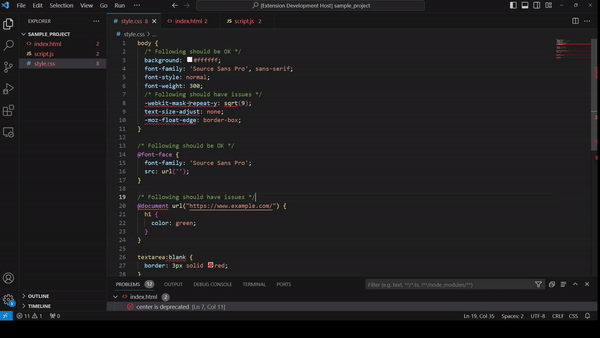

# Browser compatibility checker

A tool for analyzing frontend code to find browser compatibility issues powered by [MDN compatibility data](https://developer.mozilla.org/en-US/)

- Scans HTML, CSS & JS files for compatibility issues
- Reports both deprecated & mixed-support features
- Supports configuration of target browsers

## VSCode Extension

### Extension Settings

- `browser-compatibility-checker.enableOnChange`: Enable this extension on start and file change
- `browser-compatibility-checker.useError`: Use a severity of 'Error' for each problem (otherwise uses 'Warning')
- `browser-compatibility-checker.browserList`: Which browsers to check compatibility for (defaults to all MDN recognised browsers)
- `browser-compatibility-checker.warnForOtherBrowsers`: Show a warning for issues with browsers not in the browser list
- `browser-compatibility-checker.foldersToIgnore`: Glob paths to exclude from scanning

## CLI Tool

`node out/cli.js`

### Arguments

- **-f, --folder**: Folder path to scan
- **-b, --browsers**: Comma seperated list of browsers to check (defaults to all)

## Local development

### Installation

1. `npm install`
2. `npm run watch`
3. Open VSCode & press F5 to run the extension

## Disclaimer

This tool is not a replacement for cross-browser testing and cannot verify how elements will perform on various browsers.
Elements which are not flagged as incompatible may still have issues on some browsers.
